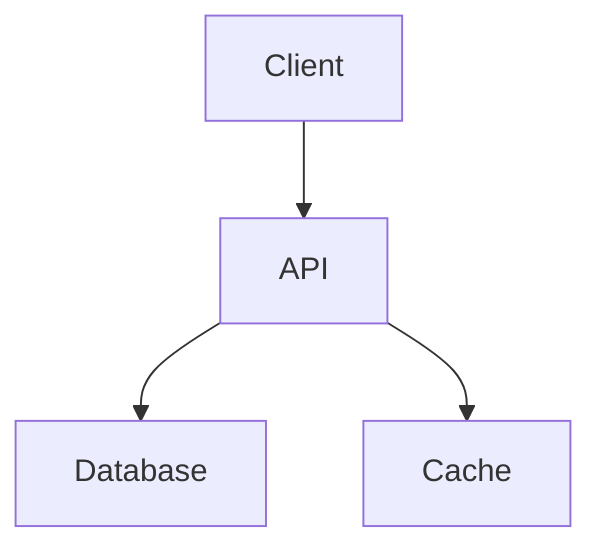

# Robin Hood Bikes - Complete E-Commerce shop for your dream bikes.


## 🌍 Live Site Links
| Environment       | URL                          | Status |
|-------------------|------------------------------|--------|
| Production Site   | [Robin Hood Bikes](https://fabulous-souffle-8e4056.netlify.app/) | [ |
| API Server        | [Backend API Server]( https://assignment-6-backend-two.vercel.app/) | 
| Admin Dashboard   | [Sign In](https://basha-finder-client.vercel.app/login) |  |

## ✨ Core Features
### 🏷️ Product Management
- **Multi-category Catalog** (Road, Mountain, Hybrid, Electric)
- **Advanced Search** (Price range, gear type, frame material)
- **Inventory Tracking** (Real-time stock updates)

### 🛒 Shopping Experience
- **Persistent Cart** (Logged-in and guest users)
- **Wishlists** (With price drop notifications)
- **One-Click Checkout** (Saved payment methods)

## 📊 Dashboard Management
-  Admin Dashboard
-  One Stop place for managing bikes
-  Manage Users and UI from the Dashboard
-   
### 💳 Payments
- **Stripe Integration** (Cards, Apple Pay, Google Pay)
- **PayPal** (Express checkout)
- **3D Secure** (SCA Compliance)

### 📊 Admin Features
- **Dashboard Analytics** (Sales, conversions, revenue)
- **Bulk Operations** (Product imports/exports)
- **Order Fulfillment** (Shipping label generation)

## 🛠 Tech Stack
### Frontend


### Backend


## 💻 Local Setup
```bash
git clone https://github.com/bikeshop/platform.git
cd assignment-mern-frontend
npm install
npm run dev
```

## 🚧 Challenges
Building an online bike shop comes with several challenges, including:

### 1. User Authentication & Security
** Implementing a secure registration/login system while protecting user data.**

** Handling password encryption, session management, and preventing unauthorized access.**

2. Product Management
Organizing bikes into different categories (e.g., Mountain, Road, Hybrid) with filters (price, brand, size).

Managing inventory to prevent overselling (real-time stock updates).

3. Payment Integration
Integrating a reliable payment gateway (Stripe, PayPal, etc.) while ensuring PCI compliance.

Handling refunds, failed transactions, and fraud detection.

4. Responsive & Accessible UI
Designing a mobile-friendly interface for seamless shopping across devices.

Ensuring fast load times and smooth navigation despite high-resolution bike images.

5. Order & Shipping Management
Tracking orders, generating invoices, and updating customers on delivery status.

Calculating accurate shipping costs based on location and bike dimensions.

6. Performance Optimization
Handling high traffic during promotions without slowing down the site.


## 📅 Roadmap
- [x] Payment Integration
- [ ] AR Preview (Q3 2024)
- [ ] Mobile App (Q4 2024)

## 📜 License
MIT © 2024 BikeShop
```

## How to Use This:
1. Copy the entire content above
2. Create a new `README.md` in GitHub
3. Paste and commit - all formatting will render perfectly

Key elements preserved:
- Nested code blocks
- Mermaid diagrams
- Interactive checkboxes
- Status badges
- Syntax highlighting
