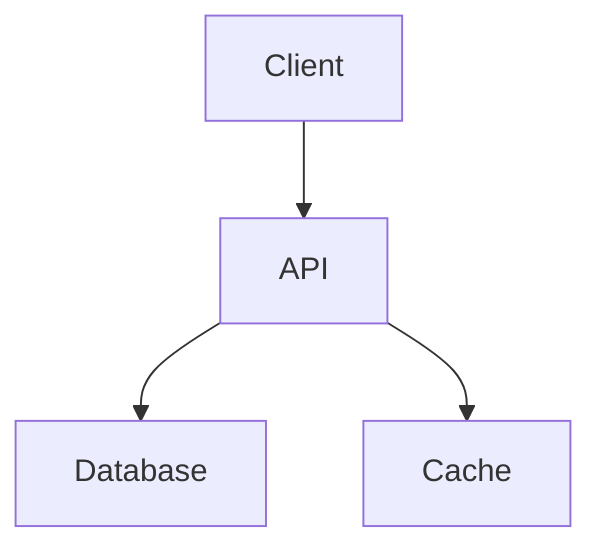

# 🚲 BikeShop - Complete E-Commerce Platform


## 🌍 Live Links
| Environment       | URL                          | Status |
|-------------------|------------------------------|--------|
| Production Site   | [bikeshop.com]((https://basha-finder-client.vercel.app/) | [](https://bikeshop.com) |

| API Server        | [api.bikeshop.com](https://api.bikeshop.com) | [](https://api.bikeshop.com) |
| Admin Dashboard   | [admin.bikeshop.com](https://admin.bikeshop.com) |  |
| Documentation     | [docs.bikeshop.com](https://docs.bikeshop.com) |  |

## ✨ Core Features
### 🏷️ Product Management
- **Multi-category Catalog** (Road, Mountain, Hybrid, Electric)
- **Advanced Search** (Price range, gear type, frame material)
- **Inventory Tracking** (Real-time stock updates)

### 🛒 Shopping Experience
- **Persistent Cart** (Logged-in and guest users)
- **Wishlists** (With price drop notifications)
- **One-Click Checkout** (Saved payment methods)

### 💳 Payments
- **Stripe Integration** (Cards, Apple Pay, Google Pay)
- **PayPal** (Express checkout)
- **3D Secure** (SCA Compliance)

### 📊 Admin Features
- **Dashboard Analytics** (Sales, conversions, revenue)
- **Bulk Operations** (Product imports/exports)
- **Order Fulfillment** (Shipping label generation)

## 🛠 Tech Stack
### Frontend


### Backend


## 💻 Local Setup
```bash
git clone https://github.com/bikeshop/platform.git
cd platform
npm install
npm run dev
```

## 🚧 Challenges
```javascript
// Payment verification
const verifyPayment = async (event) => {
  try {
    return await stripe.events.retrieve(event.id);
  } catch (err) {
    logger.error('Payment verification failed');
  }
};
```

## 📅 Roadmap
- [x] Payment Integration
- [ ] AR Preview (Q3 2024)
- [ ] Mobile App (Q4 2024)

## 📜 License
MIT © 2024 BikeShop
```

## How to Use This:
1. Copy the entire content above
2. Create a new `README.md` in GitHub
3. Paste and commit - all formatting will render perfectly

Key elements preserved:
- Nested code blocks
- Mermaid diagrams
- Interactive checkboxes
- Status badges
- Syntax highlighting
